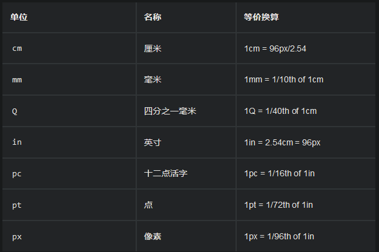
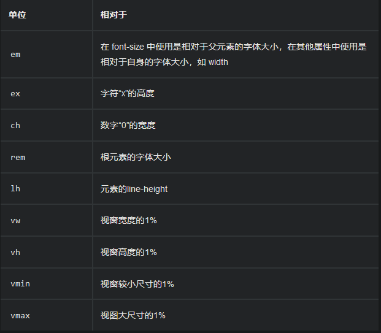

### 数字，长度和百分比

#### 长度

- 绝对长度

  

- 相对长度

  

##### em和rems

- em是父元素的字体大小
- rem是根元素的字体大小

##### 百分比

##### 数字

##### 颜色

- 十六进制RGB值

- RGB和RGBA的值

- HSL和HSLA的值

  色调

  饱和度

  亮度

##### 图片

##### 位置

##### 字符串和标识符

##### 函数

calc()函数