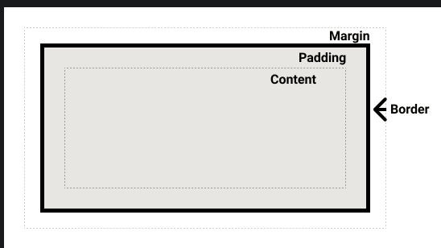
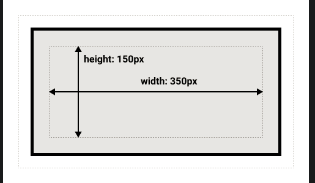
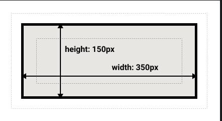

## 盒模型

### 块级盒子Block box 和内联盒子 Inline box

#### 块级盒子

- 盒子会在内联的方向上扩展并占据父容器在该方向上的所有可用空间
- 每个盒子都会换行
- width和height属性可以发挥作用
- 内边距，外边距和边框会将其他元素从当前盒子周围推开

#### Inline

- 盒子不会产生换行
- width和height属性不起作用
- 垂直方向的内边距，外边距以及边框会被应用但是不会把其他处于inline状态的盒子推开
- 水平方向的内边距，外边距以及边框会被应用且会把其他处于inline的状态的盒子推开

### 盒模型的各个部分

- content box
- padding box
- border box
- margin box

#### 标准盒模型

#### IE盒模型

#### 外边距

设置负值会导致和其他元素重叠

- margin-top
- margin-right
- margin-bottom
- margin-left

##### 外边距折叠

#### 边框

如果使用的是替代盒模型，边框的大小会使内容框变小

- border-top
- border-right
- border-bottom
- border-left

样式

- border-width
- border-style
- border-color

#### 内边距

不能有负值的内边距

- padding-top
- padding-right
- padding-bottom
- padding-left

